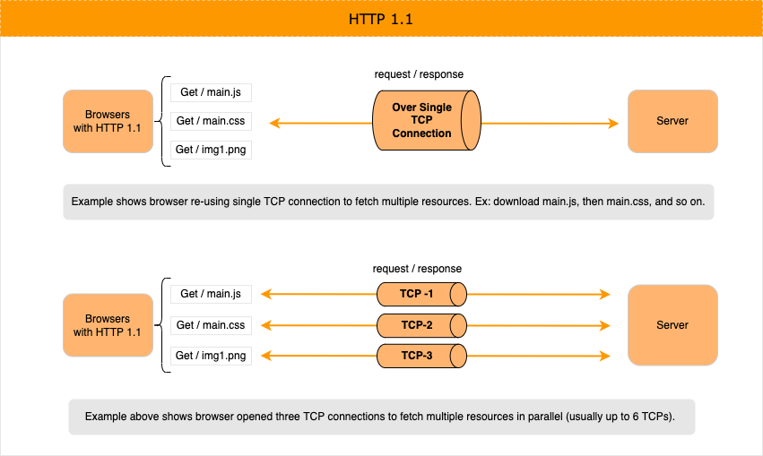
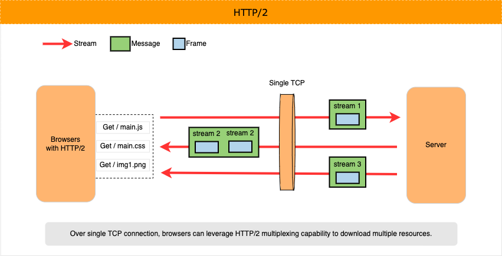
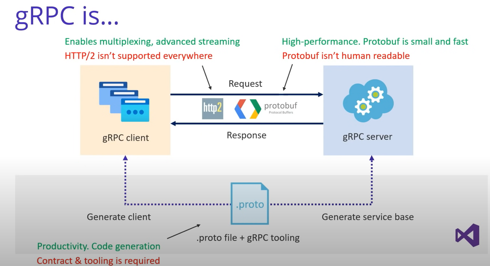

# Learn gRPC (Remote Procedure Call)

## WHY gRPC

<details>
<summary>click to expand</summary>

1. gRPC is created to
    1. Achieve low latency for service-2-service communication in a large-scale distributed system (e.g. microservices).
    1. Be super efficient over low-power and low-bandwidth systems.
    1. run anywhere; support multi language/platform environments. Example, client could be in `GO` and server could be in `.NET`.
    1. and more ...

1. gRPC efficiency gains are the result of
    1. Its language-neutral, platform-neutral, extensible mechanism for serializing structured data called Protocol Buffer (protobuf).
    1. Leveraging HTTP/2 `multiplexing` capabilities. Browsers can do more over fewer TCP connections and more on this later.

1. gRPC could be a good target when modernizing WCF. Note, CoreWCF exists as well.

</details>

## Important Tangent (HTTP 1.1 and HTTP/2)

<details>
<summary>click to expand</summary>

gRPC takes advantage of HTTP/2 multiplexing capability to achieve great performance. Let’s understand it better.

### **HTTP 1.1**

Quick refresher of the familiar, HTTP 1.1.

<details>
<summary>click to expand</summary>

1. HTTP 1.1 only supports single request/response model per TCP connection.

1. Browsers can re-use single persistent TCP connection to fetch multiple resources one-by-one. Example, download main.js, then main.css, and so on.

1. Now to fetch multiple resources in parallel - help improve performance - browsers must open and use multiple TCP connections (limits apply).

    

</details>

### **HTTP/2**

HTTP/2 new binary framing layer resolves the head-of-line blocking problem found in HTTP/1.x and eliminates the need for multiple connections to enable parallel processing and delivery of requests and responses. This makes our applications faster, simpler, and cheaper to deploy. 

Let's see how.

<details>
<summary>click to expand</summary>

1. HTTP/2 is designed with goals to 1/ reduce latency by enabling full request and response *multiplexing*, 2/ minimize protocol overhead via efficient compression of HTTP header fields, 3/ add support for request prioritization, and more.

1. HTTP 1.1 core concepts - ex: HTTP methods, status codes, URIs - remain in place. HTTP/2 modifies how the data is exchanged: new binary framing layer, which dictates how the HTTP messages are encapsulated and transferred between the client and server.

1. HTTP/2 breaks down the HTTP protocol communication into an exchange of binary-encoded frames, which are then mapped to messages that belong to a particular stream, and all of which are multiplexed within a single TCP connection.

    This is the foundation that enables all other features and performance optimizations provided by the HTTP/2 protocol.

1. Diagram below shows anatomy of the binary-encoded frames: `Stream`, `Message`, and `Frame`.
    1. Stream - A bidirectional flow of bytes within an established connection, which may carry one or more messages.
    1. Message - A complete sequence of frames that map to a logical request or response message.
    1. Frame - The smallest unit of communication in HTTP/2, each containing a frame header, which at a minimum identifies the stream to which the frame belongs.

    

</details>

</details>

## gRPC Core Concepts

<details>
<summary>click to expand</summary>

1. gRPC is a method of communication between services like HTTP API.
    1. gRPC does require HTTP/2 and TLS.

1. Compared to HTTP API, big difference is how gRPC is setup and transports the data.

    1. For communication between client/server, gRPC relies on known service contracts called Protocol Buffers (Protobuf), which are shared among the client/server. Client could be a browser, console application, another service etc.
    1. gRPC communicates using binary data stream. Compared to the JSON/XML, its more compact and faster to serialize.
    1. Also, unlike JSON, binary data stream isn’t human readable and we need tooling which exists (not a concern and more of a FYI).

1. gRPC takes a contract-first approach to service (i.e. API) development. This service contract is defined in plain text file called, `.proto`.
    1. In `.proto` file, you will use a language agnostic syntax to define the shape of your service: method signature and strongly typed request/response messages.

        ```c#
        // Sample .proto file
    
        syntax = "proto3";
        
        // The greeting service definition.
        service Greeter {
          // Sends a greeting
          rpc SayHello (HelloRequest) returns (HelloReply);
        }
        
        // The request message containing the user's name.
        message HelloRequest {
          string name = 1;
        }
        
        // The response message containing the greetings.
        message HelloReply {
          string message = 1;
        }
        ```

1. Against `.proto` file(s), you will use gRPC tooling - protobuf complier called *protoc* - to auto-generate service contract implementation in your preferred programming language (e.g. NET, Java, Python, and more).

1. gRPC tooling helps generate 1/ implementation (i.e. methods) defined by the service’s contract and 2/ base type that will contain message classes (i.e. Data Models) and more. Later, we will explore this in example with .NET.

1. Unlike HTTP APIs, gRPC services cannot be called directly from the browser (as of today June 2022).
    1. Approaches like gRPC-web, Transcoding (maps HTTP/JSON to gRPC methods), and gRPC-gateway make this use case possible. More on this later.

1. Diagram below summarizes gRPC basics (source .NET)

    

</details>
