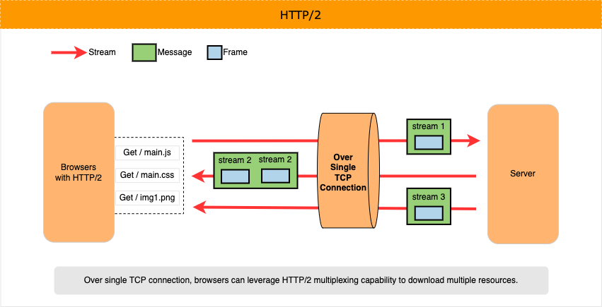

# Learn gRPC (Remote Procedure Call)

## gRPC TL;DR

<details open>
<summary>click to expand</summary>

1. [gRPC](https://grpc.io/docs/what-is-grpc/introduction/) is an open source Remote Procedure Call (RPC) framework created by Google and now part of the Cloud Native Computing Foundation (CNCF).

1. It was created to 1/ achieve low latency for service-to-service communication in distributed system, 2/ be super efficient over low-power and low-bandwidth systems, 3/ be language and platform neutral.

1. gRPC's awesomeness is driven by three primary pillars
    1. Uses HTTP/2 as its underlying transport protocol and leverages HTTP/2 `multiplexing` capabilities to help reduce network latency and achieve more over fewer TCP connections.
    1. Communicates messages (request/response) in [Protocol buffers (`protobuf`)](https://developers.google.com/protocol-buffers/docs/overview); it's more compact than JSON and faster to serialize.
    1. Off the same gRPC service contract, its tooling can auto-generate client/server code to achieve a polyglot environment ([supported language](https://grpc.io/docs/languages/)). For instance, .NET server-side, Python client-side, and both interoperate using strongly typed messages (protobuf).

1. RESTful JSON Web APIs can be automatically created from gRPC services by annotating the `.proto` file with HTTP metadata. This allows an app to support both gRPC and JSON web APIs, without duplicating effort of building separate services for both ([HTTP API & gRPC comparison](https://docs.microsoft.com/en-us/aspnet/core/grpc/comparison?view=aspnetcore-6.0)).

</details>

<br/>

## Important Tangent (HTTP 1.1 and HTTP/2)

<details>
<summary>click to expand</summary>

To fully understand what makes gRPC so performant, its vey helpful (not required) to understand the challenges of HTTP 1.1. and resolutions provided by HTTP/2.

<br/>

### **HTTP 1.1** (refresher of the familiar)

<details>
<summary>click to expand</summary>

1. Over a single TCP connection, HTTP 1.1 supports a single request/response model between client (e.g. browser) and server.

1. This HTTP 1.x limitation commonly runs into Head-of-Line problem: over single TCP, new request has to wait for the previous request to complete before the client can make a new request.

1. Browsers can re-use single persistent TCP connection to fetch multiple website resources, BUT one-by-one. Example, download main.js (request/response), then main.css, and so on.

1. And to fetch multiple resources in parallel - help improve performance - browsers must open and use multiple TCP connections (usually up to 6 connections per hostname).

    

</details>

<br/>

### **HTTP/2**

<details>
<summary>click to expand</summary>

1. HTTP/2 introduced a new binary framing layer to 1/ help resolve head-of-line blocking problem found in HTTP 1.x and 2/ reduce latency over single TCP connection.

1. HTTP/2 reduce latency by multiplexing requests over the single TCP connection, 2/ minimize protocol overhead via efficient compression of HTTP header fields, 3/ support for request prioritization, and more.

    > Multiplexing: clients can make multiple requests to a server without having to wait for the previous ones to complete, the responses can arrive in any order.

1. HTTP/2 breaks down the HTTP protocol communication into an exchange of binary-encoded frames, which are then mapped to messages that belong to a particular stream, and all of which are multiplexed over a single TCP connection.
    1. This is the foundation that enables all other features and performance optimizations provided by the HTTP/2 protocol.

1. Diagram below shows anatomy of the HTTP/2 new binary-encoded frames: `Stream`, `Message`, and `Frame`.
    1. Stream - A bidirectional flow of bytes within an established connection, which may carry one or more messages.
    1. Message - A complete sequence of frames that map to a logical request or response message.
    1. Frame - The smallest unit of communication in HTTP/2, each containing a frame header, which at a minimum identifies the stream to which the frame belongs.

    

</details>

</details>

<br/>

## gRPC Basic Building Blocks

<details>
<summary>click to expand</summary>

Diagram below summarizes gRPC basics (source .NET)


<br/>

### **gRPC Protocol Buffers (`protobuf`)**

<details>
<summary>click to expand</summary>

1. [`protobuf`](https://developers.google.com/protocol-buffers/docs/overview) is Google's open-source mechanism to serialize structured, record-like, typed data in a language-neutral, platform-neutral, extensible manner.

1. gRPC uses `protobuf` for both 1/ Interface Definition Language (IDL) and 2/ as its underlying message interchange format.
    1. Note, gRPC can be used with other data formats such as JSON.

1. compared to JSON, `protobuf` is 1/ more compact (relatively smaller payloads), and 2/ faster to serialize.

    >  protobuf pyaload is unreadable for humans but tooling exist to assist with this.

</details>

<br/>

### **gRPC Services**

<details>
<summary>click to expand</summary>

1. Like with many RPC systems, gRPC is takes a contract-first approach to service development (i.e APIs). - specifying methods with parameters and return types that you want to serialize - which a client application can call as if it were a local object.
1. You define your service's contract in a language neutral syntax, saved in a plain text file with the extension, `".proto"`. Example below.

    ```c#
    /* Description: In a language neutral syntax below, we have defined desired structure of our service:
        * Service named "Greeter".
        * With single method named "SayHello", which can be called remotely.
        * "SayHello" method will communicate messages in strongly typed format, HelloRequest and HelloReply. 
    */
    
    syntax = "proto3";
    
    // The greeting service definition.
    service Greeter {
        // Method: Sends a greeting
        rpc SayHello (HelloRequest) returns (HelloReply);
    }
    
    // The request message containing the user's name.
    message HelloRequest {
        string name = 1;
    }
    
    // The response message containing the greetings.
    message HelloReply {
        string message = 1;
    }
    ```

1. Against this `.proto` file - service contract in it - you use Protocol Buffer compiler (`protoc`) to auto-generate code in your desired [gPRC supported language](https://grpc.io/docs/languages/) (e.g. .NET, Python, Java etc.).
1. Protocol Buffer compiler can also generate 1/ gRPC client and server code, 2/ the regular `protobuf` code like 1/ methods defined by the service’s contract, 2/ retrieving data from files and streams, 3/ serialize data back to a file or stream, and 4/ other useful functions.
1. Off the same `.proto` file, you can auto-generate multi-language client/server setup. For instance, server-code in .NET, client-code in Python, and communicate in `protobuf`.

1. Diagram below summarizes the flow from this defining in `protobuf` to useable auto-generated code.

    

</details>

<br/>

### **gRPC Client/Server Communication**

<details>
<summary>click to expand</summary>

1. On server side, the server implements your service's contract and runs a gRPC server to handle client calls.
1. On client side, the client has a stub (referred to as just a client in some languages) that provides the same methods - via shared service contract - as the server.
1. Unlike HTTP APIs, gRPC services cannot be called directly from the browser (as of June 2022).
1. Approaches like gRPC-web, Transcoding (maps HTTP/JSON to gRPC methods), and gRPC-gateway make this use case possible.
    1. Reference [Modernization with gRPC](./3.modernization-with-grpc.md) section for more details.

</details>
