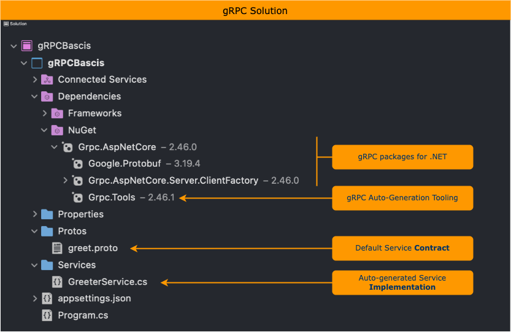
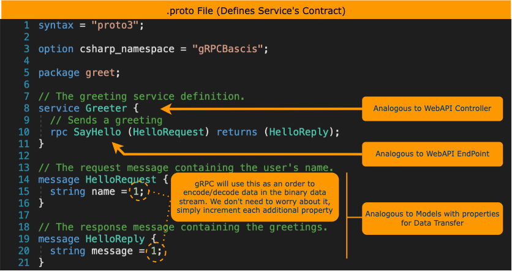
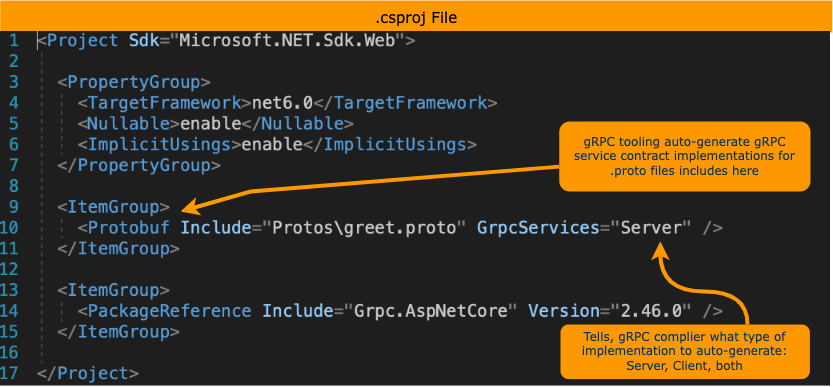

# Build gRPC Service With .NET

We will learn and explore building gRPC services with .NET framework (aka .NET Core).

## Building gRPC Services

1. In Visual Studio/VS-Code, use `"gRPC Service"` template to create your new .NET 6 project called, 'gRPCBasics'.
    1. If you're familiar with WebAPI development in .NET, then it's like creating WebAPI backend project.

    Diagram below points out gRPC centric artifacts auto-created for the gRPCBasics project.

    

1. Recall, gRPC takes a contract-first approach to service (i.e. API) development. This service contract is defined in plain text file called, `.proto`. You will use language agnostic syntax to define your service's contract (i.e. protobuf), between the client and the server. The `.proto` file contains:
    1. Definition of the gRPC service.
    1. Messages sent between clients and servers.

    Diagram below shows the `.proto` file auto-created for our sample gRPCBasics project.

    

1. Diagram below shows the auto-generated implementation for the gRPC service contract by the gRPC tooling.

    

1. But how does gRPC know about the `.proto` files?
    1. gRPC will auto-generate implementation of gRPC service contracts that are defined by the "`Protobuf`" item group in `.csproj` file.

    

## Testing gRPC Services

1. Recall, you cannot call gRPC services directly from the browser. So unlike HTTP API, you cannot run your sample application and get to the gRPC API (service).
1. For GUI option to call gRPC services, try [BloomRPC](https://github.com/bloomrpc/bloomrpc).
1. For CLI option, try [grpcurl]((https://github.com/fullstorydev/grpcurl)).
1. A more involved option, try creating .NET Console application acting as the gRPC service's client. [Microsoft Documentations](https://github.com/bloomrpc/bloomrpc).