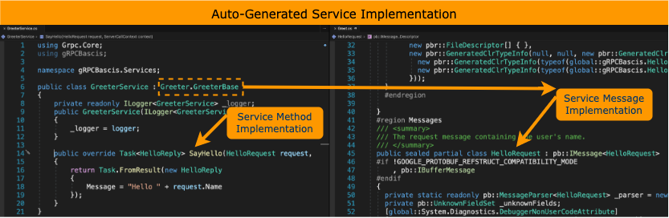

# Build gRPC Service With .NET

You will learn and explore basic about building gRPC services with .NET (aka .NET Core).

## Walkthrough - Building gRPC Services

1. In Visual Studio/VS-Code, use "gRPC Service" template to create your new .NET 6 project called, `gRPCBasics`.
    1. If you're familiar with WebAPI development in .NET, then it's like creating WebAPI backend project.

1. Diagram below points out gRPC centric artifacts which are auto-created for your `gRPCBasics` project.

    

1. Refresher: 
    1. gRPC takes a contract-first approach to service (i.e. API) development
    1. You will use language neutral syntax to define your service's contract in plain text file called `.proto`, which will be shared among the client and the server. 
    1. The `.proto` file contains 1/ definition of the gRPC service and 2/ messages exchanged between clients and servers.

1. Diagram below shows the `.proto` file which gets auto-created for your sample `gRPCBasics` project.

    

1. Diagram below shows the auto-generated implementation for the gRPC service contract by the gRPC tooling.

    

1. But how does gRPC know about the `.proto` files?
    1. gRPC will auto-generate implementation for service contracts that are defined by the "`Protobuf`" item group in `.csproj` file.

    

## Testing gRPC Services

1. Recall, you cannot call gRPC services directly from the browser. So unlike HTTP API, you cannot run your sample application and get to the gRPC API (service).
1. For GUI option to call gRPC services, try [BloomRPC](https://github.com/bloomrpc/bloomrpc).
1. For CLI option, try [grpcurl](https://github.com/fullstorydev/grpcurl).
1. A more involved option, try creating .NET Console application acting as the gRPC service's client. [Microsoft Documentations](https://github.com/bloomrpc/bloomrpc).
