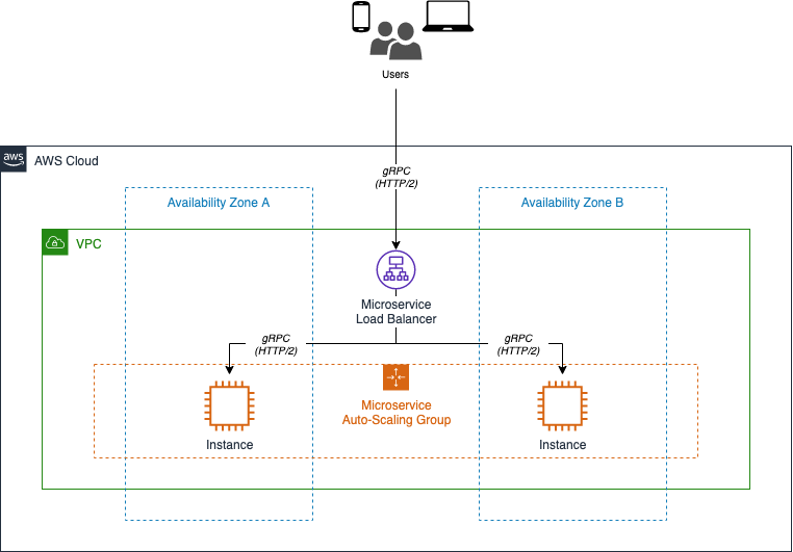

# Modernization Paths for gRPC Services

Unlike HTTP APIs, gRPC services cannot be called directly from the browser. Below, we will look at few different options to facilitate calling gRPC services directly from the client (e.g. Browser apps).

> Options below assume you are going to target .NET LTS, Linux, and Cloud Native Services (here AWS).

## [Option A]: gRPC with Application Load Balancer ([More Info](https://aws.amazon.com/blogs/devops/next-generation-microservices-dotnet-grpc/))

### Setup

1. gRPC services are built with .NET LTS version and hosted on container service like AWS Elastic Container Service/Amazon Elastic Kubernetes Service.
1. AWS Application Load Balancer is configured with gRPC protocol, uses HTTP/2, and maintains healthy gRPC service instances (via Target Group).
    1. ALBs can inspect and route gRPC calls, enabling features like health checks, access logs, and gRPC-specific metrics.
1. Client (e.g. Browser) can call gRPC service as shown below

    ```csharp
        using var channel = GrpcChannel.ForAddress("https://track-order.example.com");
    
        var trackOrderClient = new TrackOrder.Protos.TrackOrder.TrackOrderClient(channel);
        
        var reply = await trackOrderClient.StartTrackingOrderAsync(new TrackOrder.Protos.Order
        {
            DeliverTo = "Address",
            LastUpdated = Timestamp.FromDateTime(DateTime.UtcNow),
            OrderId = order.OrderId,
            PlacedOn = order.PlacedOn,
            Status = TrackOrder.Protos.OrderStatus.Placed
        });
    ```

1. Diagram below shows the architecture

    

## [Option B]: gRPC-Web

1. gRPC-web is a JavaScript implementation of gRPC for browser clients. It gives you all the advantages of working with gRPC, such as efficient serialization, a simple IDL, and easy interface updating.
1. In .NET, there are two options to use gRPC-web
    1. Support gRPC-Web alongside gRPC HTTP/2 in ASP.NET Core. This option uses middleware provided by the Grpc.AspNetCore.Web package.
    1. Use the Envoy proxy's gRPC-Web support to translate gRPC-Web to gRPC HTTP/2. The translated call is then forwarded onto the ASP.NET Core app.
1. For more details, please reference [Microsoft documentations](https://docs.microsoft.com/en-us/aspnet/core/grpc/browser?view=aspnetcore-6.0).

## [Option C]: Transcoding (enables RESTFul JSON APIs for gRPC)

1. gRPC JSON transcoding runs inside an ASP.NET Core app. It deserializes JSON into Protobuf messages, then invokes the gRPC service directly. Once configured in .NET project, JSON transcoding allows apps to call gRPC services with familiar HTTP concepts:
    1. HTTP verbs
    2. URL parameter binding
    3. JSON requests/responses

1. gRPC can still be used to call services.

The SayHello gRPC method can now be invoked as gRPC and as a JSON Web API:

- Request: HTTP/1.1 GET /v1/greeter/world
- Response: { "message": "Hello world" }

Diagram below shows RESTFul annotation, `option (google.api.http) ...`  
([diagram source](https://docs.microsoft.com/en-us/aspnet/core/grpc/httpapi#json-transcoding-vs-grpc-web)).

```csharp showLineNumbers
syntax = "proto3";

import "google/api/annotations.proto";

package greet;

service Greeter {
    rpc SayHello (HelloRequest) returns (HelloReply) {
    option (google.api.http) = {
        get: "/v1/greeter/{name}"
    };
    }
}

message HelloRequest {
    string name = 1;
}

message HelloReply {
    string message = 1;
}
```

## Transcoding vs. gRPC-Web [More details](https://docs.microsoft.com/en-us/aspnet/core/grpc/httpapi)

- gRPC-Web lets browser apps call gRPC services from the browser with the gRPC-Web client and Protobuf. gRPC-Web requires the browser app generate a gRPC client, and has the advantage of sending small, fast Protobuf messages.

- JSON transcoding allows browser apps to call gRPC services as if they were RESTful APIs with JSON. The browser app doesn't need to generate a gRPC client or know anything about gRPC.

Transcoding vs. gRPC-gateway [More details](https://docs.microsoft.com/en-us/aspnet/core/grpc/httpapi#grpc-gateway)

- gRPC-gateway is another technology for creating RESTful JSON APIs from gRPC services. It uses code generation to create a reverse-proxy server. The reverse proxy translates RESTful calls into gRPC+Protobuf and sends the calls over HTTP/2 to the gRPC service.

- Benefit: gRPC service doesn't know about the RESTful JSON APIs. Any gRPC server can use grpc-gateway.
